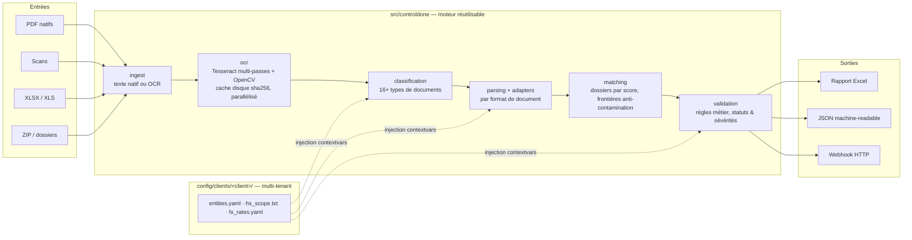

# ControlDOne

Moteur de contrôle documentaire douanier : il lit des dossiers d'import réels — **factures marchandises, déclarations en douane, factures de droits & taxes du transitaire** — les rapproche automatiquement en dossiers, vérifie leur cohérence métier et produit un rapport d'audit exploitable.

Le problème d'origine est un classique des directions douane/supply : des centaines de dossiers par mois, trois familles de documents qui arrivent en vrac (PDF natifs, scans de qualité variable, exports Excel), et un contrôle de cohérence entièrement manuel — long, répétitif, non traçable. ControlDOne transforme ce contrôle en **pipeline automatisé, mesurable et multi-clients**.

```
fichiers en vrac (PDF / scans / XLSX / ZIP / dossiers)
   → ingestion            texte natif ou OCR industrialisé
   → classification       16+ formats de documents reconnus
   → parsing              montants, TVA/SIREN, HS, MRN/AWB, droits & taxes
   → matching             regroupement en dossiers par score de correspondance
   → validation métier    la facture marchandise fait foi
   → rapport Excel + JSON + webhook
```

## Architecture



Trois surfaces d'utilisation, un seul moteur (`pipeline.analyze`) :

| Surface | Usage | Point d'entrée |
|---|---|---|
| **CLI** | batch, tâches planifiées, orchestrateurs | `controldone` / `python main.py` |
| **Web locale** | dépôt de fichiers par glisser-déposer pour les équipes | `controldone-web` (Flask, port 8765) |
| **API Python** | intégration dans une app ou un notebook | `from controldone.pipeline import analyze` |

## Ce que vérifie le moteur

La **facture marchandise fait foi** ; chaque dossier reçoit un statut consolidé (`OK`, `OK_A_CONTROLER`, `KO`, `KO_BLOQUANT`, `MANQUE_DOC`) issu de contrôles unitaires typés (code, section, sévérité, bloquant ou non) :

- **Complétude** — facture exploitable + déclaration présentes, sinon `MANQUE_DOC` ;
- **Entité** — la TVA/SIREN facturée appartient au périmètre du client et correspond à la déclaration (le SIREN imprimé fait foi : l'OCR abîme la clé TVA, rarement les 9 chiffres) ;
- **Valeur & devise** — total facture = valeur déclarée (tolérances configurées, conversion au taux de la déclaration, garde-fou sur devise mal lue) ;
- **Nomenclature** — chaque HS6 de la facture est repris sur la déclaration, avec une table de confusions OCR de chiffres (0↔6/8/9…) qui rétrograde en avertissement les codes probablement mal lus plutôt que de bloquer à tort ;
- **Droits & taxes** — les débours du transitaire = DD + AT + TVA de la déclaration (au centime, tolérance paramétrée).

Le principe transversal : **conservateur par construction**. Une valeur absente de la facture n'est reprise de la déclaration que si elle est *visible dans le texte OCR* de la facture (variantes de format, somme de sous-ensembles de lignes, évidence HS) — jamais recopiée aveuglément. Un doute = un avertissement à contrôler, pas un faux OK.

## OCR industrialisé

Le point dur du projet : des scans de qualité très variable, des proformas à grilles, des polices minuscules.

- Texte natif PyMuPDF prioritaire ; bascule OCR si la page est pauvre en texte ou majoritairement image ;
- Prétraitement OpenCV : CLAHE, seuillage adaptatif, redressement (Hough), détection d'orientation OSD + balayage 90/180/270°, **effacement des grilles de tableaux à 400 dpi** pour récupérer les lignes à petits caractères ;
- Multi-passes Tesseract (PSM 6/4/3 puis modes « sparse » 11/12), départagées par un **score de qualité orienté douane** (mots-clés, formats HS, TVA, devises) puis fusion catégorie par catégorie des lignes métier trouvées par les passes perdantes ;
- **Cache disque par empreinte sha256 de la page** (les relances sont instantanées), OCR parallélisé par page avec propagation explicite du profil client dans les threads ;
- Re-OCR ciblé d'enrichissement uniquement quand une donnée critique manque ou paraît suspecte.

## Multi-tenant par profils clients

Le moteur ne contient **aucune donnée client**. Tout ce qui dépend de l'entité contrôlée vit dans un profil YAML sous `config/clients/<client>/` : entités et TVA/SIREN, alias de noms et d'adresses, périmètre HS, taux de change spécifiques. Les profils sont injectés par `contextvars` (sûr en multi-thread), sélectionnés par `--client`, `CONTROLDONE_CLIENT` ou auto-détection, et **jamais committés** (`.gitignore`) — seuls le modèle documenté `_template/` et le profil fictif `demo/` sont versionnés.

## Intégration & automatisation

Conçu pour se brancher tel quel dans un orchestrateur (n8n, Power Automate, tâche planifiée) :

- **CLI orchestrable** — sortie `--json` structurée (résumé, dossiers, contrôles unitaires), `--webhook URL` (POST du résultat en fin d'analyse), codes retour parlants : `0` aucun dossier bloquant, `1` anomalies détectées, `2` erreur d'usage ; progression sur stderr, résultat sur stdout.
- **API HTTP locale** — `GET /health` (sonde JSON : Tesseract, version), `GET /clients` (profils disponibles), `POST /run` (multipart PDF/XLSX/ZIP ou chemin local, paramètre `client`, réponse JSON avec `?format=json` ou `Accept: application/json`), `GET /download/<rapport>`.
- **API Python** — `analyze(input_path, profile=...) → ControlRun` : dataclasses pures, sérialisation JSON directe.

Recette type n8n / Power Automate :

```
Déclencheur (nouveau dossier SharePoint / arrivée d'email avec pièces jointes)
  → HTTP POST http://hôte:8765/run?format=json  (multipart files=..., client=acme)
  → Condition : $.summary.anomalies > 0 ?
      oui → poster les dossiers KO_BLOQUANT dans Teams + créer un ticket
      non → archiver le rapport ($.report_url)
```

Équivalent en tâche planifiée pure CLI :

```bash
controldone --input //serveur/depot/imports --client acme --json \
            --webhook https://n8n.interne/webhook/controle-douane
# code retour 1 => la tâche remonte l'échec ; le JSON dit précisément pourquoi
```

## Démarrage rapide

```bash
pip install -e .[dev]
# Tesseract requis pour les scans : https://github.com/UB-Mannheim/tesseract/wiki (Windows)
# ou brew install tesseract tesseract-lang (macOS)

# profil de démonstration (données fictives) fourni :
controldone --input /chemin/vers/documents --client demo --json

# interface web locale :
controldone-web --open-browser        # http://127.0.0.1:8765
```

Les lanceurs `Lancer_ControlDOne_Windows.bat` / `_Mac.command` installent l'environnement et ouvrent l'interface web pour un poste utilisateur non technique.

## Qualité

- `pytest` : tests de non-régression d'extraction **gelés sur extraits OCR réels anonymisés** — chaque test épingle un échec observé en production, la suite répond en un dixième de seconde sans PDF ni Tesseract ;
- test dédié de propagation du profil client dans les workers OCR (le piège classique des `contextvars` + threads) ;
- garde-fous d'exécution : extraction ZIP sécurisée (anti path-traversal), tolérances de rapprochement explicites, statuts « à contrôler » plutôt que faux positifs.

## Structure du dépôt

```
controldone/
├── main.py                     # lanceur local (sans installation)
├── src/controldone/
│   ├── pipeline.py             # orchestration : LA porte d'entrée programmatique
│   ├── ingest.py / ocr.py      # lecture fichiers, OCR multi-passes + cache
│   ├── classification.py       # reconnaissance des 16+ formats de documents
│   ├── parsing.py / adapters/  # extraction par format (déclarations, factures, prestations)
│   ├── matching.py             # regroupement en dossiers par score
│   ├── validation.py           # règles métier, statuts, sévérités
│   ├── reporting.py            # rapport Excel multi-onglets
│   ├── reporting_json.py       # sortie machine-readable + webhook
│   ├── profile.py / paths.py   # profils clients (multi-tenant), ancrage des chemins
│   ├── cli.py / webapp.py      # surfaces CLI et web
│   └── models.py               # dataclasses : Document, Bundle, CheckResult...
├── config/
│   ├── clients/_template/      # modèle de profil client documenté
│   ├── clients/demo/           # profil fictif de démonstration
│   └── rules/fx_rates.yaml     # taux de change indicatifs par défaut
├── tests/                      # non-régression extraction + injection de profil
└── docs/ARCHITECTURE.md        # conception détaillée module par module
```

## Feuille de route

- Externaliser les sévérités de contrôle en configuration par profil (aujourd'hui codées dans `validation.py`) ;
- Export CSV des contrôles unitaires pour l'analytique ;
- File d'attente de jobs et suivi d'avancement côté web ;
- Contrôle poids nets/bruts et préférences tarifaires (extraction déjà en place, règle à brancher).

## Licence

Code publié à des fins de démonstration. Tous droits réservés — me contacter pour toute utilisation commerciale.
